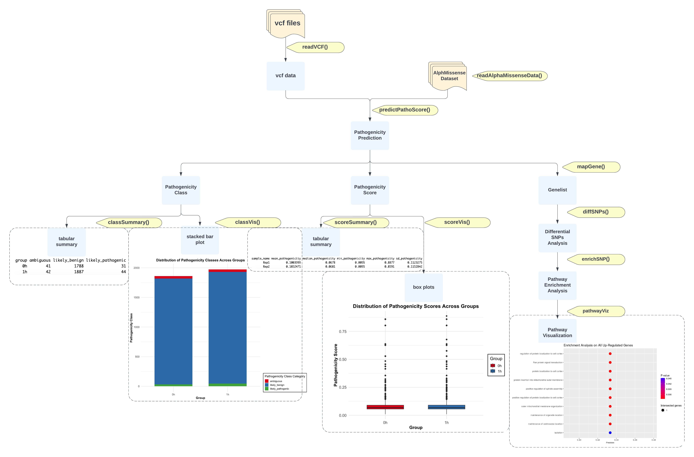

<!-- README.md is generated from README.Rmd. Please edit that file -->

```{r, include = FALSE}
knitr::opts_chunk$set(
  collapse = TRUE,
  comment = "#>",
  fig.path = "man/figures/README-",
  out.width = "100%"
)
```

# MissensePathoR

<!-- badges: start -->
<!-- badges: end -->

## Description

`MissensePathoR` is an R package designed to perform pathogenicity analysis of missense variants across the human proteome using AlphaMissense's deep learning predictions, catering to both single variant and gene-level analyses. This package provides quantitative and qualitative pathogenicity analysis across user defined groups, and uniquely offers users a platform to explore differential distributions and patterns of pathogenicity scores, thus enriching the understanding of missense variants' impact in genomics research. MissensePathoR is the first R package that facilitates comparisons between pathogenicity scores of variants in groups, further enriched by its provision for visualization of score and class distribution patterns, and ranked gene pathway enrichment analyses. The package analyses variant call format (vcf) file, which is the standardized text file format used in bioinformatics for storing gene sequence variations (Danecek et al., 2011), making it particularly valuable for researchers in genome-wide association studies (GWAS) and those involved in variant calling of whole-genome or single-cell RNA sequencing analysis. The `MissensePathoR` package is developed using `R version 4.3.1 (2023-06-16)`, `Platform: aarch64-apple-darwin22.4.0` and `x86_64-pc-linux-gnu`, and `Running under: aarch64, darwin22.4.0` and `x86_64, linux-gnu`.

AlphaMissense is a state-of-the-art deep learning model that predicts the pathogenicity of single-amino acid changes in proteins using sequence data and structural context (Cheng et al., 2023). The variant effect prediction score is defined as the log-likelihood difference between the reference amino acid and the alternative amino acid, indicating likelihood of a variant being pathogenic (closer to 0 more likely benign variant, closer to 1 more likely pathogenic variant). The class prediction is to interpret a variant as “likely pathogenic,” “ambiguous,” or “likely benign." with model define threshold score values.

## Installation

You can install the development version of MissensePathoR from [GitHub](https://github.com/) with:

``` r
# install.packages("devtools")
devtools::install_github("Lola-W/MissensePathoR", build_vignettes = TRUE)
library("MissensePathoR")
```

Shiny app underconstruction.

## Overview
```{r, eval=FALSE}
ls("package:MissensePathoR")
data(package = "MissensePathoR")
```

`MissensePathoR` contain functions to:

1. **Reading Variant Call Format (VCF) Files**: Enables the import and processing of VCF files. (See function `readVCF`)

2. **Retrieving AlphaMissense Data**: Acquires the AlphaMissense prediction dataset, essential for the subsequent annotation of variants. (See function `readAlphaMissenseData`)

3. **Predicting Pathogenicity Scores**: Annotates variants with pathogenicity scores derived from the AlphaMissense dataset. (See function `predictPathoScore`)

4. **Summary of Variant Classes**: Provides a tabular summary of the annotated SNPs between groups, including the proportions of benign, ambiguous, and pathogenic variants or the pathogenicity scores in scalar value. (See functions `classSummary` and `scoreSummary`)

5. **Visualization of Pathogenicity Class Proportions**: Utilizes stacked bar plots to visually represent the proportions of each pathogenicity class within and between groups. (See function `classVis`)

6. **Visualization of Score Distributions**: Employs box plots to show the distribution of pathogenicity scores within and between groups. (See function `scoreViz`)

7. **Gene Mapping for Variants**: Annotates all variants to genes, highlighting their location in and around genes. (See function `mapGene`)

8. **Differential SNPs Analysis**: Performs differential gene expression analysis between assigned groups, ranking genes based on variant frequency and pathogenicity score. (See function `diffSNPs`)

9. **Pathway Enrichment Analysis**: Conducts pathway enrichment analysis on the ranked gene list to identify significant pathways. (See function `enrichSNP`)

10. **Pathway Visualization**: Provides dot plots that display enriched pathways, enhancing the interpretability of pathway analysis results. (See function `pathwayViz`)

```R
browseVignettes("MissensePathoR")
```

An overview of the package's workflow and interaction between its various functions is illustrated below:



## Contributions
The MissensePathoR package is authored by Jiaming Weng. The author wrote all the functions. All the functions depend on `data.table` package for data saving and reading, all the visualization functions (`classViz` and `scoreViz`) are powered by package `ggplot2` for graph generating and `RColorBrewer` for coloring.`readVCF` used `read.vcfR` in `vcfR` package to read and process vcf files, `readAlphaMissenseData` make use of the publicly available AlphaMissense dataset provided by Google Deepmind.The dependencies of the underconstructing gene-level analyses and shiny app functionalities will be specified later. ChatGPT4 is used to provide insights for debug and documentation, and write error checking for all the functions, its contribution is cited in the comments of the code as `# contributed by ChatGPT-4`.

For the data:

- AlphaMissenseSample.rda is a partition of the dataset publically available by AlphaMissense in https://console.cloud.google.com/storage/browser/dm_alphamissense (Cheng et al., 2023).  

- vcfSample.rda is  Chromosomes 1-5 of 4 vcf files that generated from fastq files in GSE113171 (Rendleman et al., 2018) from Gene Expression Omnibus by the author. 

## References
- Cheng, J., Novati, G., Pan, J., Bycroft, C., Žemgulytė, A., Applebaum, T., Pritzel, A., Wong, L. H., Zielinski, M., Sargeant, T., Schneider, R. G., Senior, A. W., Jumper, J., Hassabis, D., Kohli, P., & Avsec, Ž. (2023). Accurate proteome-wide missense variant effect prediction with AlphaMissense. Science, 381(6664), eadg7492. https://doi.org/10.1126/science.adg7492
- Danecek, P., Auton, A., Abecasis, G., Albers, C. A., Banks, E., DePristo, M. A., Handsaker, R. E., Lunter, G., Marth, G. T., Sherry, S. T., McVean, G., & Durbin, R. (2011). The variant call format and VCFtools. Bioinformatics, 27(15), 2156–2158. https://doi.org/10.1093/bioinformatics/btr330
- Dowle M, Srinivasan A (2023). _data.table: Extension of `data.frame`_. R package version 1.14.8, <https://CRAN.R-project.org/package=data.table>.
- H. Wickham. ggplot2: Elegant Graphics for Data Analysis. Springer-Verlag New York, 2016.
- Johansen, N., Somasundaram, S., Travaglini, K. J., Yanny, A. M., Shumyatcher, M., Casper, T., Cobbs, C., Dee, N., Ellenbogen, R., Ferreira, M., Goldy, J., Guzman, J., Gwinn, R., Hirschstein, D., Jorstad, N. L., Keene, C. D., Ko, A., Levi, B. P., Ojemann, J. G., … Miller, J. A. (2023). Interindividual variation in human cortical cell type abundance and expression. Science, 382(6667), eadf2359. https://doi.org/10.1126/science.adf2359
- Knaus BJ, Grünwald NJ (2017). “VCFR: a package to manipulate and visualize variant call format data in R.” _Molecular Ecology Resources_, *17*(1), 44-53.
  ISSN 757, <https://dx.doi.org/10.1111/1755-0998.12549>.
- Neuwirth E (2022). _RColorBrewer: ColorBrewer Palettes_. R package version 1.1-3, <https://CRAN.R-project.org/package=RColorBrewer>.
- Raudvere, Uku, Liis Kolberg, Ivan Kuzmin, Tambet Arak, Priit Adler, Hedi Peterson, and Jaak Vilo. 2019. “G: Profiler: A Web Server for Functional Enrichment Analysis and Conversions of Gene Lists (2019 Update).” Nucleic Acids Research 47 (W1): W191–98.
- St»hle, L., & Wold, S. (1989). Analysis of variance (ANOVA). Chemometrics and Intelligent Laboratory Systems, 6(4), 259–272. https://doi.org/10.1016/0169-7439(89)80095-4
Wang, K., Li, M., & Hakonarson, H. (2010). ANNOVAR: Functional annotation of genetic variants from high-throughput sequencing data. Nucleic Acids Research, 38(16), e164–e164. https://doi.org/10.1093/nar/gkq603

## Acknowledgements

This package was developed as part of an assessment for 2023 BCB410H: Applied Bioinformatics course at the University of Toronto, Toronto, CANADA. `MissensePathoR` welcomes issues, enhancement requests, and other contributions. To submit an issue, use the GitHub issues.
