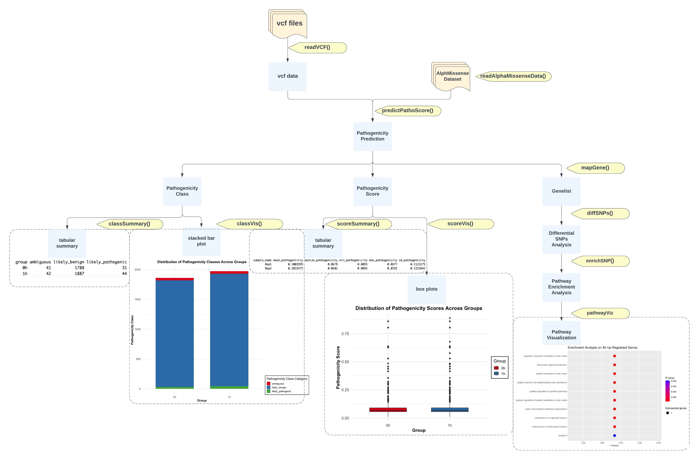

```{r setup, include=FALSE}
library(knitr)
opts_chunk$set(fig.align = "center", 
               out.width = "90%",
               fig.width = 6, fig.height = 5.5,
               dev.args=list(pointsize=10),
               par = TRUE, # needed for setting hook 
               collapse = TRUE, # collapse input & ouput code in chunks
               warning = FALSE)
knit_hooks$set(par = function(before, options, envir)
  { if(before && options$fig.show != "none") 
       par(family = "sans", mar=c(4.1,4.1,1.1,1.1), mgp=c(3,1,0), tcl=-0.5)
})
set.seed(1) # for exact reproducibility
```

## Instruction
`MissensePathoR` is an R package designed to perform pathogenicity analysis of missense variants across the human proteome using AlphaMissense's deep learning predictions, catering to both single variant and gene-level analyses. This package provides quantitative (`score`) and qualitative (`class`) pathogenicity analysis across user defined groups, and uniquely offers users a platform to explore differential distributions and patterns of pathogenicity scores, thus enriching the understanding of missense variants' impact in genomics research. MissensePathoR is the first R package that facilitates comparisons between pathogenicity scores of variants in groups, further enriched by its provision for visualization of score and class distribution patterns, and ranked gene pathway enrichment analyses. The package analyses variant call format (vcf) file, which is the standardized text file format used in bioinformatics for storing gene sequence variations (Danecek et al., 2011), making it particularly valuable for researchers in genome-wide association studies (GWAS) and those involved in variant calling of whole-genome or single-cell RNA sequencing analysis. 

To download **MissensePathoR**, use the following commands:

``` r
require("devtools")
devtools::install_github("anjalisilva/MissensePathoR", build_vignettes = TRUE)
library("MissensePathoR")
```
To list all sample functions available in the package:
``` r
ls("package:MissensePathoR")
```

To list all sample datasets available in the package:
``` r
data(package = "MissensePathoR")
```

### Detail on AlphaMissense
AlphaMissense is a state-of-the-art deep learning model that predicts the pathogenicity of single-amino acid changes in proteins using sequence data and structural context (Cheng et al., 2023). The variant effect prediction score is defined as the log-likelihood difference between the reference amino acid and the alternative amino acid, indicating likelihood of a variant being pathogenic (closer to 0 more likely benign variant, closer to 1 more likely pathogenic variant). The class prediction is to interpret a variant as “likely pathogenic,” “ambiguous,” or “likely benign." with model define threshold score values.

## Components



## Application

Here, we demonstrate some typical applications of the package's functions using the included sample datasets on hg38 human reference genome.

### Loading Sample Data

The package comes with sample datasets (`vcfSample` for sample vcf files readed containing variants, `AlphaMissenseSample` for a small subset of AlphaMissense dataset, and `predScoreSample` for a dataset of annotated variants with predicted pathogenic class and score) that can be used to test and explore the features provided. Take `AlphaMissenseSample.rda` as an example, to load a sample dataset and see its structure, use the following commands:

``` r
AlphaMissenseSample <- MissensePathoR::AlphaMissenseSample
head(AlphaMissenseSample)
```
```
# Expected Output
   CHROM     POS REF ALT genome uniprot_id     transcript_id protein_variant am_pathogenicity      am_class
1:  chr1  942451   T   C   hg38     Q96NU1 ENST00000342066.8           W343R           0.0292 likely_benign
2:  chr1  942451   T   C   hg38     Q96NU1 ENST00000342066.8           W343R           0.0292 likely_benign
3:  chr1  942451   T   C   hg38     Q96NU1 ENST00000342066.8           W343R           0.0292 likely_benign
4:  chr1 1014228   G   A   hg38     P05161 ENST00000649529.1            S83N           0.0873 likely_benign
5:  chr1 1014228   G   A   hg38     P05161 ENST00000649529.1            S83N           0.0873 likely_benign
6:  chr1 1014228   G   A   hg38     P05161 ENST00000649529.1            S83N           0.0873 likely_benign
```

### Read VCF Files into a Data Table

The `readVCF` function is a critical component of the MissensePathoR package, designed to process Variant Call Format (VCF) files. This function takes a DataFrame, as created by helper function `createVCFDataFrame` with regex expression on `base_dir`, `vcf_pattern`, `group_pattern`, and `sample_pattern`, and reads each VCF file, linking it with its corresponding group and sample information. The resulting data is combined into a single `data.table`.

#### Functionality

`readVCF` performs the following key steps:

- Iterates over each row of the DataFrame, reading the VCF file specified in the 'file_name' column.
- Utilizes `vcfR::read.vcfR` for reading the VCF files, ensuring an accurate and efficient processing of genomic data.
- Save the VCF data into a `data.table` format.
- Filters and processes the VCF data to focus on single nucleotide polymorphisms (SNPs), providing warnings for non-SNP variants.

#### Usage Example

Below is an example of how to use `readVCF` in conjunction with `createVCFDataFrame` to process VCF files:

```r
# Define the path to VCF files
vcf_files_path <- system.file("extdata", package = "MissensePathoR")

# Helper function to create a DataFrame of VCF files, here the format of the vcf
# file is ./inst/extdata/0h_Rep1.vcf, the groups are in format "([0-9]+)h".
vcf_df <- createVCFDataFrame(vcf_files_path,"*.vcf","([0-9]+)h","Rep([0-9]+)")

# Read and combine VCF data into a data.table
vcf_data <- readVCF(vcf_df)
head(vcf_data)
```
Warnings can be provided when the VCF file contains variants that are not single nucleotide polymorphisms (SNPs). They will be handled by automatically discard those variants.
```
# Expected Output
   CHROM     POS   ID REF ALT    QUAL FILTER group sample_name
1:  chr1  942335 <NA>   C   G 330.658   <NA>    0h        Rep1
2:  chr1  942451 <NA>   T   C 330.055   <NA>    0h        Rep1
3:  chr1  944296 <NA>   G   A 114.554   <NA>    0h        Rep1
4:  chr1  952091 <NA>   G   A 675.217   <NA>    0h        Rep1
5:  chr1  953259 <NA>   T   C 312.092   <NA>    0h        Rep1
6:  chr1 1013493 <NA>   A   G 86.8186   <NA>    0h        Rep1
```

### Read AlphaMissense Data

The `readAlphaMissenseData` function in MissensePathoR retrieve and process prediction data from AlphaMissense.

#### Functionality

`readAlphaMissenseData` offers the following capabilities:

- Retrieves and loads the AlphaMissense data.
- Processes the data into a `data.table` formats.

#### Usage Example

To use the full AlphaMissense dataset for hg38, download it from the official source (https://storage.googleapis.com/dm_alphamissense/AlphaMissense_hg38.tsv.gz) and specify the path. Please `gunzip */AlphaMissense_hg38.tsv.gz` in terminal before using it. Note the the unzipped dataset takes 5GB, ensure the designated directory have enough storage for it. Warnings are provided when you use the demo data comes with the package.

Below is an example demonstrating how to use `readAlphaMissenseData`:

```r
# Load the demo dataset
demo_data <- readAlphaMissenseData()
head(demo_data)
# full_data <- readAlphaMissenseData("path/to/AlphaMissense_hg38.tsv")
```
```
# Expected Output
   CHROM     POS REF ALT genome uniprot_id     transcript_id protein_variant am_pathogenicity      am_class
1:  chr1  942451   T   C   hg38     Q96NU1 ENST00000342066.8           W343R           0.0292 likely_benign
2:  chr1  942451   T   C   hg38     Q96NU1 ENST00000342066.8           W343R           0.0292 likely_benign
3:  chr1  942451   T   C   hg38     Q96NU1 ENST00000342066.8           W343R           0.0292 likely_benign
4:  chr1 1014228   G   A   hg38     P05161 ENST00000649529.1            S83N           0.0873 likely_benign
5:  chr1 1014228   G   A   hg38     P05161 ENST00000649529.1            S83N           0.0873 likely_benign
6:  chr1 1014228   G   A   hg38     P05161 ENST00000649529.1            S83N           0.0873 likely_benign
```

### Predict Pathogenicity Scores for VCF Data

The `predictPathoScore` function in MissensePathoR integrate variant data from VCF files with the pathogenicity predictions provided by AlphaMissense.

#### Functionality

`predictPathoScore` offers the following key functionalities:

- Merges VCF data with Alpha Missense predictions based on genomic coordinates (CHROM, POS) and alleles (REF, ALT).
- Only variants with corresponding predictions in the AlphaMissense dataset are included.
- Add pathogenicity scores and classifications to each row of variants

#### Usage Example

Below is an example showcasing the use of `predictPathoScore`:

```r
# vcfSample and AlphaMissenseSample are loaded datasets in the package
prediction <- predictPathoScore(vcfSample, AlphaMissenseSample)
head(prediction)
```
```
# Expected Output
   CHROM    POS   ID REF ALT    QUAL FILTER group sample_name genome uniprot_id     transcript_id protein_variant am_pathogenicity
1:  chr1 942451 <NA>   T   C 330.055   <NA>    0h        Rep1   hg38     Q96NU1 ENST00000342066.8           W343R           0.0292
2:  chr1 942451 <NA>   T   C 896.756   <NA>    1h        Rep1   hg38     Q96NU1 ENST00000342066.8           W343R           0.0292
3:  chr1 942451 <NA>   T   C 559.644   <NA>    1h        Rep2   hg38     Q96NU1 ENST00000342066.8           W343R           0.0292
4:  chr1 942451 <NA>   T   C 330.055   <NA>    0h        Rep1   hg38     Q96NU1 ENST00000342066.8           W343R           0.0292
5:  chr1 942451 <NA>   T   C 896.756   <NA>    1h        Rep1   hg38     Q96NU1 ENST00000342066.8           W343R           0.0292
6:  chr1 942451 <NA>   T   C 559.644   <NA>    1h        Rep2   hg38     Q96NU1 ENST00000342066.8           W343R           0.0292
        am_class
1: likely_benign
2: likely_benign
3: likely_benign
4: likely_benign
5: likely_benign
6: likely_benign
```

### Tabular Summary of Class Distributions and Pathogenicity Scores

The MissensePathoR package provides two essential functions, `classSummary` and `scoreSummary`, for generating tabular summaries of class distributions and pathogenicity scores, respectively.

#### Summarize Class Distribution by Group

The `classSummary` function calculates and returns a summary of the count of each pathogenicity class within each group.

##### Functionality

- Counts the occurrences of each pathogenicity class (`am_class`) within each group.
- Returns a data table with groups as rows and classes as columns, where cell values represent counts.

##### Usage Example

Here's how to use `classSummary` to get a summary of class distributions:

```r
summary <- classSummary(MissensePathoR::predScoreSample)
print(summary)
```
```
# Expected Output
  group ambiguous likely_benign likely_pathogenic
  <chr>     <int>         <int>             <int>
1 0h           41          1788                31
2 1h           42          1887                44
```

#### Calculate Summary Pathogenicity Scores by Specified Category

The `scoreSummary` function provides a summary of pathogenicity scores within specified categories of the data.

##### Functionality

- Calculates summary statistics (mean, median, minimum, maximum, standard deviation) for pathogenicity scores.
- Groups data based on a specified category (default is `group`).

##### Usage Example

Use `scoreSummary` to analyze pathogenicity scores:

```r
# Summary by group
group_summary <- scoreSummary(predScoreSample, category = "group")
print(group_summary)

# Summary by sample name
sample_summary <- scoreSummary(predScoreSample, category = "sample_name")
print(sample_summary)
```
```
# Expected Outputs
> print(group_summary)
# A tibble: 2 × 6
  group mean_pathogenicity median_pathogenicity min_pathogenicity max_pathogenicity sd_pathogenicity
  <chr>              <dbl>                <dbl>             <dbl>             <dbl>            <dbl>
1 0h                 0.100               0.0679            0.0095             0.859            0.110
2 1h                 0.103               0.0679            0.0095             0.888            0.117
> print(sample_summary)
# A tibble: 2 × 6
  sample_name mean_pathogenicity median_pathogenicity min_pathogenicity max_pathogenicity sd_pathogenicity
  <chr>                    <dbl>                <dbl>             <dbl>             <dbl>            <dbl>
1 Rep1                     0.100               0.0678            0.0095             0.888            0.112
2 Rep2                     0.103               0.0681            0.0095             0.859            0.115
```

### Visualize Proportions of Pathogenicity Classes

The `classVis` function in MissensePathoR is designed to visually represent the distribution of pathogenicity classes across different groups. It creates a stacked barplot, for user to compare distribution of classes within and between the specified groups.

#### Functionality

- Creates a stacked barplot to visualize the proportions of pathogenicity classes (`am_class`).
- Allows the selection of specific groups for comparison or uses all available groups if none are specified.
- Returns a `ggplot` object.

#### Usage Example

Here's an example of how to use `classVis` for visualizing class distributions:

```r
# Visualize pathogenicity class distributions for specific groups
classVis(predScoreSample, groups = c("0h", "1h"))
```


### Visualize Distribution of Pathogenicity Scores

The `scoreVis` function in the MissensePathoR package is an essential tool for visualizing the distribution of pathogenicity scores across different groups. This function generates box plots of the variations in pathogenicity scores within and between specified groups.

#### Functionality

- Produces box plots to visualize the distribution of `am_pathogenicity` scores.
- Allows the selection of specific groups for comparison, or uses all available groups if none are specified.
- Returns a `ggplot` object.

#### Usage Example

Here's how to use `scoreVis` to visualize pathogenicity score distributions:

```r
# Visualize pathogenicity score distributions for specific groups
scoreVis(predScoreSample, groups = c("0h", "1h"))
```


### Pathway Enrichment Analysis on Variants

#### Sequential Workflow

It's important to follow the sequential order of functions for pathway enrichment analysis in `MissensePathoR`:

1. **`mapGene`**: Start by mapping UniProt IDs to HGNC gene names.
2. **`diffSNPs`**: Perform differential SNP analysis.
3. **`enrichSNP`**: Conduct pathway enrichment analysis on the differential SNP data.
4. **`pathwayViz`**: Visualize the enriched pathways for comprehensive insights.

Note that the data we used in demo is a small subset of real world variant data, the results are for functionality demonstration purpose, instead of capturing true biological meaning.

### Map Variants to HGNC Gene Names Using `mapGene`

The `mapGene` function in the `MissensePathoR` package is integral for linking variants to genes. It maps the AlphaMissense predicted UniProt IDs to HGNC gene names, facilitating gene-centric analysis of variants. This function serves as a foundational step in the pathway enrichment analysis workflow, which includes `mapGene`, `diffSNPs`, `enrichSNP`, and `pathwayViz`.

#### Functionality

- Maps UniProt IDs to HGNC gene names using `UniProt.ws`.
- Ensures seamless integration of gene names into the variant dataset.
- Essential for downstream analyses like differential SNP analysis and pathway enrichment.

#### Usage Example

```r
# Mapping UniProt IDs to HGNC gene names
result <- mapGene(predScoreSample)
head(result)
```
```
# Expected Output
   uniprot_id sample_name group CHROM       POS REF ALT genome     transcript_id protein_variant am_pathogenicity      am_class    QUAL hgnc_gene
1: A0A1B0GUY1        Rep1    0h  chr5 148242620   A   T   hg38 ENST00000638089.2            Q75L            0.096 likely_benign 490.051    MARCOL
2: A0A1B0GUY1        Rep2    0h  chr5 148242620   A   T   hg38 ENST00000638089.2            Q75L            0.096 likely_benign 298.776    MARCOL
3: A0A1B0GUY1        Rep1    1h  chr5 148242620   A   T   hg38 ENST00000638089.2            Q75L            0.096 likely_benign 354.507    MARCOL
4: A0A1B0GUY1        Rep1    0h  chr5 148242620   A   T   hg38 ENST00000638089.2            Q75L            0.096 likely_benign 490.051    MARCOL
5: A0A1B0GUY1        Rep2    0h  chr5 148242620   A   T   hg38 ENST00000638089.2            Q75L            0.096 likely_benign 298.776    MARCOL
6: A0A1B0GUY1        Rep1    1h  chr5 148242620   A   T   hg38 ENST00000638089.2            Q75L            0.096 likely_benign 354.507    MARCOL
```

### Differential SNP Analysis

The `diffSNPs` function in `MissensePathoR` is designed for differential SNP analysis. It relies on `edgeR`, known for handling differential expression analysis in genomic studies. employs a novel approach that incorporates pathogenicity scores and variant frequencies, calculated as pseudo gene counts. This function enable user to study the genetic variations' impact on disease pathology on a gene level across various conditions or time points.

#### Functionality

- **Variant Frequency as Pseudo Gene Count**: Treats variant frequency as pseudo gene count and normalizes it using Counts Per Million (CPM) method.
  -  **Original CPM Calculation**:
   \[ \text{CPM}_{\text{original}} = \left( \frac{\text{Variant Frequency}}{\text{Total Count}} \right) \times 10^6 \]
- **Weighted CPM Calculation**: Integrates pathogenicity score for weighted CPM calculation, providing a more nuanced measure of variant expression.

  - **Defining Weight Categories Based on Pathogenicity Score**:
  Here, we used the AlphaMissense pathogenicity score threshold use by Google Deepmind in the original paper (Cheng et al., 2023).
   
    - **Likely Benign**: Score < 0.34
    - **Ambiguous**: 0.34 ≤ Score ≤ 0.564
    - **Likely Pathogenic**: Score > 0.564
   
  - **Weighted CPM Calculation**:
  
    - The CPM calculation is adjusted to include the pathogenicity score.
      \[ \text{CPM}_{\text{weighted}} = \text{CPM}_{\text{original}} \times \text{Weight} \]
    - Weights: Likely Benign = 0.5, Ambiguous = 1, Likely Pathogenic = 2.

- **Quasi-Likelihood Model**: Uses a Quasi-likelihood model from the `edgeR` package to account for over-dispersion in the data.

#### Usage Example

```r
# predScoreSample has been processed through mapGene
result <- mapGene(predScoreSample)
result$sample_name = paste0(result$sample_name, "_", result$group) # a more clear sample_name

# differential SNP analysis
diffOut <- diffSNPs(result, "0h")
head(diffOut$table)
```
```
# Expected Output
            logFC    logCPM            F       PValue          FDR
GPSM2    16.14934 13.033618 1.450518e+09 1.669858e-07 1.764484e-05
MTX1     14.31932 11.205159 2.696520e+00 2.862663e-01 1.000000e+00
MAP3K21  12.31953  9.211887 1.615637e+02 1.836420e-02 3.632406e-01
NBAS     12.31953  9.211887 1.615637e+02 1.836420e-02 3.632406e-01
ABHD14A  12.14964  9.043080 1.280933e+02 2.170586e-02 3.632406e-01
ARHGEF11 12.14964  9.043080 1.280933e+02 2.170586e-02 3.632406e-01
```

### Pathway Enrichment Analysis on the Differential SNP Data

The `enrichSNP` function in the `MissensePathoR` package provides pathway enrichment analysis for SNP data. Utilizing g:Profiler, it identifies significant pathways among genes categorized based on their pseudo expression in previous differential SNP analysis. This tool is essential for deciphering the biological significance and pathways associated with differentially expressed genes.

#### Functionality

- **Gene Categorization**: Separates genes into up-regulated, down-regulated, and all significantly thresholded groups based on log fold changes (logFC) and False Discovery Rate (FDR).
- **Edge Case Handling**: In scenarios with very few significantly differentially expressed genes, the function adjusts gene lists to ensure robust analysis. This includes expanding the gene list based on fold changes to maintain a minimum number for analysis, and balancing the representation of up- and down-regulated genes.
- **Pathway Enrichment**: Conducts over-representation analysis using g:Profiler, specifically employing the GOST method for pathway enrichment. This analysis reveals significant pathways associated with categorized genes.
- **Result Compilation**: Returns a list of enrichment results for up-regulated, down-regulated, and all significantly thresholded genes from GO:BP("biological process" subontology of Gene Ontology).

#### Usage Example

```r
# Assuming diffOut is obtained from the diffSNPs function
enrichOut <- enrichSNP(diffOut)

# Accessing results for different categories
head(enrichOut$up$go_bp)
enrichOut$up$plot
```
```
# Expected Output
                query significant    p_value term_size query_size intersection_size precision     recall    term_id source                                                  term_name
5  Up-Regulated Genes        TRUE 0.03353309        15          3                 1 0.3333333 0.06666667 GO:0045040  GO:BP        protein insertion into mitochondrial outer membrane
6  Up-Regulated Genes        TRUE 0.03353309         8          3                 1 0.3333333 0.12500000 GO:1905832  GO:BP                    positive regulation of spindle assembly
7  Up-Regulated Genes        TRUE 0.03353309         6          3                 1 0.3333333 0.16666667 GO:1904778  GO:BP positive regulation of protein localization to cell cortex
8  Up-Regulated Genes        TRUE 0.03353309         9          3                 1 0.3333333 0.11111111 GO:1904776  GO:BP          regulation of protein localization to cell cortex
9  Up-Regulated Genes        TRUE 0.03353309        15          3                 1 0.3333333 0.06666667 GO:0007008  GO:BP                  outer mitochondrial membrane organization
10 Up-Regulated Genes        TRUE 0.03353309        11          3                 1 0.3333333 0.09090909 GO:0072697  GO:BP                        protein localization to cell cortex
   effective_domain_size source_order      parents
5                  21010        11848 GO:00066....
6                  21010        25982 GO:00512....
7                  21010        25092 GO:00726....
8                  21010        25090 GO:00726....
9                  21010         2663   GO:0007006
10                 21010        18344   GO:1990778
```


### Visualize Enrichment Pathways
The `pathwayViz` function in MissensePathoR generates dot plots, providing a clear graphical representation of the top enriched pathways for different sets of genes, such as those identified as significant, up-regulated, or down-regulated in the previous analysis.

#### Functionality

- **Input Data**: Accepts a list containing enrichment results (`enrichOut`) from a function like `gost`. This list should have elements 'sig', 'up', and 'down', each with a sub-element 'go_bp' for different gene categories.
- **Gene Set Selection**: Allows users to choose the type of genes for visualization (significant, up-regulated, down-regulated), with 'significant' as the default.
- **Dot Plot Creation**: Generates a dot plot representing the top 10 enriched pathways. The plot includes details such as precision, p-value, and the number of intersected genes in each pathway.Provides a `ggplot` object, enabling further customization and integration into reports or publications.

#### Usage Example

```r
# enrichOut is obtained from an previous enrichment analysis function like enrichSNP
# Visualize pathways for up-regulated genes
pathwayViz_output <- pathwayViz(enrichOut, type = "up")

# To display the plot
print(pathwayViz_output)
```


### Minimal requirements

* The **R subdirectory** within an R package contains all the R code files or script files. These are files ending with ".R". 

* The **man subdirectory** contains help documentation for each function that is available to the user. Help files should be autogenerated via *roxygen2* package based on the roxygen tags used in the .R files from R subdirectory.

* **DESCRIPTION** file contains metadata, including the package name, the version number, the author and maintainer contact information, along with other information.

* **NAMESPACE** file provides a "context for looking up the value of an object associated with a name". This file will contain export(), import() and importFrom() statements. This file will be auto-updated via *roxygen2* package based on the roxygen tags used in the .R files from R subdirectory.

### Other

* **README** file mainly describes what the package does. For the purpose of this course, the following elements in order are required: 1. Description, 2. Installation, 3. Overview, 4. Contributions, 5. References, and 6. Acknowledgements. Any other content of student's choice should be placed after these six elements. 

* **LICENSE** file describing who can use the R package. 

* The **data** subdirectory with data (.rda) is included to demonstrate utility of functions in the package with this data. If data is included, proper documentation for data must be provided using data.R file. Including data in the R package, however, is optional. If not providing own data, must show examples with external datasets so user of the package can still understand utility of each function. 

* The **tests** subdirectory includes the testthat subdirectory, which has test that are written to see if functions are working as expected. There should be unit tests and integration tests. 

* The **vignettes** subdirectory permit to include vignettes for the R package. A vignette is a long-form tutorial to the package, which shows the applications of functions using a sample dataset. Explain the functions to the user, the purpose, show the output to the user and explain how to interpret the output to the user. Visuals should be included, if the application of the function is to generate a visual. You may include multiple vignettes for the package, but at least one vignette should be a long form tutorial showing applicability of all the functions in the package. Vignettes must end with *sessionInfo()*; attend lecture to understand why this is. 

* The **inst** subdirectory contains other files and subdirectories. **CITATION** file should be included here. Other subdirectories may include extdata and shiny-scripts. The **extdata** subdirectory can include images included in README file. The **shiny-scripts** subdirectory should include shiny script files (app.R). 

* The local project must be housed in a GitHub repository. There should be a record of the changes made to the package via Git commit messages. For the purpose of this course, ensure the **.Rproj** file is available on GitHub. Do NOT add it to .gitignore.

## References
- Carlson M, Ramos M (2022). _UniProt.ws: R Interface to UniProt Web Services_. R package version 2.38.1.
- Cheng, J., Novati, G., Pan, J., Bycroft, C., Žemgulytė, A., Applebaum, T., Pritzel, A., Wong, L. H., Zielinski, M., Sargeant, T., Schneider, R. G., Senior, A. W., Jumper, J., Hassabis, D., Kohli, P., & Avsec, Ž. (2023). Accurate proteome-wide missense variant effect prediction with AlphaMissense. Science, 381(6664), eadg7492. https://doi.org/10.1126/science.adg7492
- Chen, Y., Lun, A. T., McCarthy, D. J., Ritchie, M. E., Phipson, B., Hu, Y., ... & Smyth, G. K. (2015). edgeR: Empirical analysis of digital gene expression data in R. Bioconductor Version: Release (3.12).
- Danecek, P., Auton, A., Abecasis, G., Albers, C. A., Banks, E., DePristo, M. A., Handsaker, R. E., Lunter, G., Marth, G. T., Sherry, S. T., McVean, G., & Durbin, R. (2011). The variant call format and VCFtools. Bioinformatics, 27(15), 2156–2158. https://doi.org/10.1093/bioinformatics/btr330
- Dowle M, Srinivasan A (2023). _data.table: Extension of `data.frame`_. R package version 1.14.8, <https://CRAN.R-project.org/package=data.table>.
- H. Wickham. ggplot2: Elegant Graphics for Data Analysis. Springer-Verlag New York, 2016.
- Johansen, N., Somasundaram, S., Travaglini, K. J., Yanny, A. M., Shumyatcher, M., Casper, T., Cobbs, C., Dee, N., Ellenbogen, R., Ferreira, M., Goldy, J., Guzman, J., Gwinn, R., Hirschstein, D., Jorstad, N. L., Keene, C. D., Ko, A., Levi, B. P., Ojemann, J. G., … Miller, J. A. (2023). Interindividual variation in human cortical cell type abundance and expression. Science, 382(6667), eadf2359. https://doi.org/10.1126/science.adf2359
- Kolberg L, Raudvere U, Kuzmin I, Vilo J, Peterson H (2020). “gprofiler2- an R package for gene list functional enrichment analysis and namespace conversion toolset
  g:Profiler.” _F1000Research_, *9 (ELIXIR)*(709). R package version 0.2.1.
- Knaus BJ, Grünwald NJ (2017). “VCFR: a package to manipulate and visualize variant call format data in R.” _Molecular Ecology Resources_, *17*(1), 44-53.
  ISSN 757, <https://dx.doi.org/10.1111/1755-0998.12549>.
- Neuwirth E (2022). _RColorBrewer: ColorBrewer Palettes_. R package version 1.1-3, <https://CRAN.R-project.org/package=RColorBrewer>.
- Raudvere, Uku, Liis Kolberg, Ivan Kuzmin, Tambet Arak, Priit Adler, Hedi Peterson, and Jaak Vilo. 2019. “G: Profiler: A Web Server for Functional Enrichment Analysis and Conversions of Gene Lists (2019 Update).” Nucleic Acids Research 47 (W1): W191–98.
- St»hle, L., & Wold, S. (1989). Analysis of variance (ANOVA). Chemometrics and Intelligent Laboratory Systems, 6(4), 259–272. https://doi.org/10.1016/0169-7439(89)80095-4
Wang, K., Li, M., & Hakonarson, H. (2010). ANNOVAR: Functional annotation of genetic variants from high-throughput sequencing data. Nucleic Acids Research, 38(16), e164–e164. https://doi.org/10.1093/nar/gkq603
------------------------------------------------------------------------

```{r}
sessionInfo()
```
